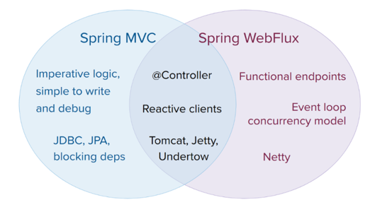

## Webflux 클린 아키텍처

---
* kotlin
* Spring boot
* Webflux
* R2dbc
* H2
* clean architecture

---

### 2022/1/3 의문점
> reactive 한 api 는 목록 전달을 할때 어떻게 하는게 패러다임의 부합하는지 확인 하여함
> 
> servlet api 기준의 page 혹은 slice response 와 같은가?
> 
> flux 형태가 reactive 한 restful api 인지 page response 확인 필요

확인필요사항
* list api response 형태
* list api 의 조회 조건 (정렬, 페이징?)
* cqrs 반드시 해야하는 지
* functional endpoints
* security
* webflux swagger
